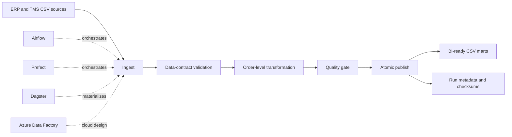

# Orchestration Data Pipelines Lab

An executable, tool-agnostic analytics pipeline demonstrating how the same
`raw → validated → modeled → published` workflow can be orchestrated by
Airflow, Prefect, Dagster, Azure Data Factory, or an enterprise SSIS-style
control flow.

The repository intentionally separates **business pipeline logic** from the
orchestration framework. The core Python package executes locally and is
covered by automated tests; the orchestration examples call that shared
implementation instead of duplicating transformations.

## Business Scenario

A deterministic generator creates eight compact ERP, WMS, TMS, CRM, planning and warehouse-activity sources. The executable pipeline processes ERP order lines and TMS shipment data for a
supply-chain control tower. It validates data contracts, creates order-service
metrics, publishes dashboard-ready marts, and records auditable run metadata.

Key metrics include:

- unit fill rate;
- complete-order rate;
- on-time delivery;
- OTIF;
- freight cost per order;
- carrier performance;
- daily rolling service metrics.

## Architecture



## Quick Start

```bash
python -m pip install -r requirements.txt
python -m pip install -e .
python data/generate_synthetic_data.py
python -m analytics_pipeline.cli \
  --input-dir data/raw \
  --output-dir data/published \
  --run-dir runs
```

Run the complete verification suite:

```bash
make verify
```

This executes an initial success, an idempotent rerun, a deterministic source-contract failure, a recovery run, and the pytest suite.

## Outputs

The executable pipeline creates:

- eight generated source CSVs under `data/raw/`
- `order_service_detail.csv`
- `daily_service_metrics.csv`
- `carrier_scorecard.csv`
- `data_quality_report.csv`
- `runs/<run_id>/run_metadata.json`
- `runs/latest.json`
- `runs/latest_failure.json` after a rejected run
- `validation/generated/scenario_report.json` during verification

## Engineering Evidence

This lab demonstrates:

- separation of orchestration and transformation logic;
- data contracts and fail-fast validation;
- structured JSON logging;
- bounded retry behavior;
- deterministic and idempotent outputs;
- atomic per-file publication;
- failed-run metadata without overwriting the last successful run pointer;
- controlled failure and recovery evidence;
- content hashes and run metadata;
- Airflow TaskFlow patterns;
- Prefect task/flow patterns;
- Dagster software-defined assets and checks;
- parameterized Azure Data Factory design;
- SSIS-to-modern-orchestration concept mapping;
- CI execution with pytest.

## Honest Scope

This is a local, portfolio-grade orchestration lab. The Airflow, Prefect,
Dagster, ADF, and SSIS artifacts demonstrate design patterns and framework
integration; they do not claim a production enterprise deployment.
