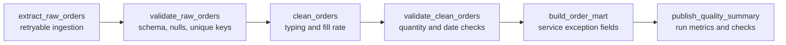

# Validation-First Orchestration Artifact

This artifact demonstrates a pipeline orchestration pattern that can be reviewed locally without installing Airflow, Prefect, Dagster, Azure Data Factory, or SSIS. It is a lab pattern, not a production deployment claim.

## Business Scenario

An analytics team needs a daily raw-to-mart pipeline that ingests operational order data, validates source quality, builds a BI-ready mart, and publishes a quality summary. The orchestration design must make retries, deterministic validation failures, dependencies, lineage, and alert assumptions visible.

## Pipeline Lineage



## What To Review

| File | Skill Evidence |
| --- | --- |
| `shared/local_pipeline_simulator.py` | Runnable task graph, dependency enforcement, retry policy, validation gates, lineage, and run summary. |
| `shared/error_handling.py` | Deterministic validation helpers for row counts, required columns, null checks, and unique keys. |
| `airflow/dags/raw_to_mart_dag.py` | Airflow-style DAG structure with retry defaults and Python operator handoff. |
| `prefect/flows/raw_to_mart_flow.py` | Prefect-style task and flow mapping that can still run without Prefect installed. |
| `shared/retry_patterns.md` | Operational retry, alert, idempotency, and validation-failure guidance. |
| `azure_data_factory/pipeline_design.md` | ADF mapping for activities, validation gates, retry policy, and monitoring. |
| `ssis/ssis_concept_mapping.md` | Enterprise ETL mapping from SSIS concepts to modern orchestration equivalents. |

## Validation Contract

The local simulator validates:

- raw row count is positive
- required source columns exist
- required source columns are not null
- `order_id` is unique
- shipped units and ordered units are non-negative
- shipped units do not exceed ordered units
- promised date does not precede order date
- mart row count is positive
- publish summary includes quality check count and service exception count

## Retry And Alert Assumptions

- Retry only transient extraction failures.
- Do not retry deterministic validation failures without data correction.
- Log attempt count, task id, row count, and final failure reason.
- Alert owners when validation gates fail or when publish summary reports service exceptions.
- Keep publish operations idempotent so reruns do not duplicate mart rows or dashboard extracts.

## Local Review

Run:

```bash
python shared/local_pipeline_simulator.py
```

Expected result:

- six successful tasks
- four quality checks
- three mart rows
- fill rate of `0.9556`
- one service exception

## Tool Mapping

| Concept | Airflow | Prefect | Dagster | Azure Data Factory | SSIS |
| --- | --- | --- | --- | --- | --- |
| Dependency graph | DAG tasks | Flow tasks | Assets / ops | Pipeline activities | Control Flow |
| Validation gate | PythonOperator / SQL check | Task assertion | Asset check | If Condition / validation activity | Precedence constraint |
| Retry policy | `retries` default arg | task retries | retry policy | activity retry policy | package/task retry pattern |
| Lineage | task ids and XCom/metadata | task run state | asset lineage | activity output metadata | package logging |
| Alerting | task failure callbacks | state handlers | sensors / alerts | monitor alerts | event handlers |
