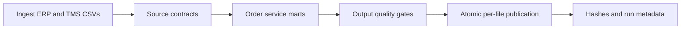

# Validation-First Orchestration Contract

This repository keeps orchestration framework code thin and places the business pipeline in `src/analytics_pipeline`. Airflow, Prefect, Dagster and cloud designs call or map to the same contract rather than duplicating transformation logic.

## Executable lineage



## Failure policy

- Retry transient filesystem reads only.
- Do not retry deterministic data-contract violations.
- Write failed-run metadata with the failed stage and exception type.
- Preserve the last successful run pointer when a later run fails.
- Validate all inputs before publishing so a rejected source cannot replace trusted outputs.
- Restore corrected inputs and rerun through the same entrypoint.

## Review command

```bash
make verify
```

The scenario runner proves four states:

1. a successful initial publication;
2. a byte-identical idempotent rerun;
3. a deterministic missing-column failure with unchanged published outputs;
4. a successful recovery after restoring the source contract.

The generated `validation/generated/scenario_report.json` is uploaded by GitHub Actions as `orchestration-validation-evidence`.

## Framework mapping

| Contract | Airflow | Prefect | Dagster | Azure Data Factory | SSIS |
| --- | --- | --- | --- | --- | --- |
| Dependency graph | TaskFlow DAG | Flow tasks | Assets | Pipeline activities | Control Flow |
| Validation gate | Python task | Task assertion | Asset check | If Condition | Precedence constraint |
| Retry | Task retry policy | Task retries | Retry policy | Activity retries | Package/task pattern |
| Metadata | Task logs/XCom | Run state | Asset metadata | Activity output | Package logging |
| Failure alert | Callback | State hook | Sensor/alert | Monitor alert | Event handler |
